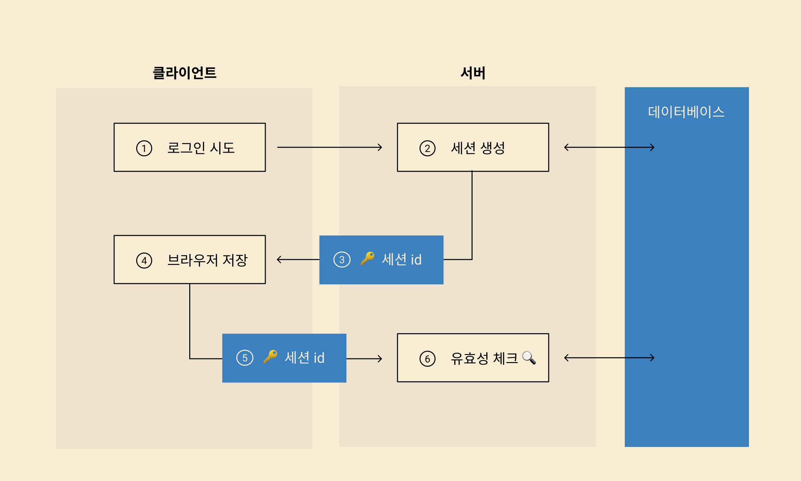
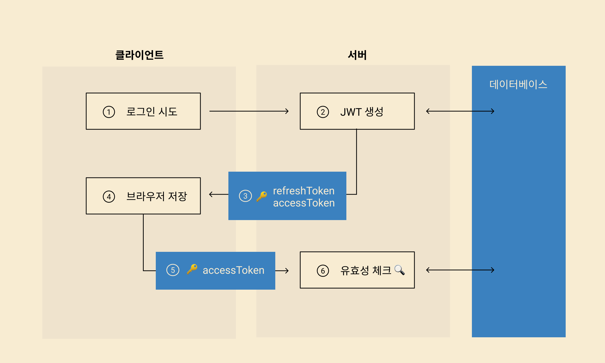

# Where to store JWT TOKEN

저번 Auctopus 프로젝트에서는 단순히 SNS 로그인 서비스로만 유저 관리를 했고, 유저의 개인정보와 토큰을 localStorage에 담아서 보관했다. 단순히 JWT의 access token을 보관하고 API요청시 헤더에 담아주는 방법을 사용했다.

# 로그인 프로세스

> 크게 **서버 기반 인증 시스템**과 **토큰 기반 인증 시스템**으로 나뉜다.

## 1. 세션 id를 사용하는 방식

> 서버는 특정 유저의 정보를 담은 세션을 생성한다.

1. 클라이언트가 로그인 요청
2. 서버는 `session`을 생성
3. 그 세션의 `id` 를 클라이언트에 전달
4. 클라이언트는 `session id` 를 보관
5. 인증이 필요한 데이터를 요청할 때, `session id` 를 서버에 전달
6. 서버는 `session id` 를 통해 유효성 검사

## 2. JWT를 이용하는 방식

> JSON Web Token의 약자로 모바일이나 웹의 사용자 인증을 `refreshToken` 과 `accessToken` 같은 암호화된 토큰을 의미한다.
> `accessToken` 을 `request` 에 담아 유효성 검사를 한다.

1. 클라이언트가 로그인 요청
2. 서버에서 JWT 암호화 후 `refreshToken` 과 `accessToken` 을 클라이언트에 전달
3. 클라이언트는 토큰을 보관
4. 인증, 인가가 필요한 요청을 보낼시에, `accessToken` 을 담아서 같이 전송
5. 서버에서는 토큰을 활용해 유효성 검사

### 토큰 추가 설명

실질적인 인증 정보는 `accessToken` 을 통해 이루어진다. 하지만 일정 시간이 지나면 만료하는 토큰이다. 만료가 된 `accessToken` 은 `refreshToken` 을 통해 갱신할 수 있다.

클라이언트가 `accessToken` 을 통해 요청을 보냈을 때, 토큰이 만료되었다면 `refreshToken` 을 보내 새로운 `accessToken` 을 받아와 재요청을 하면된다. `refreshToken` 은 옵션이기 때문에 필요에 따라 사용하자!

# 우린 왜 JWT인증 방식을 택했는가?

### 세션 인증

- **세션**은 메모리 또는 DB에 저장하는데, 로그인 요청이 많아질 경우 부하가 걸린다.
- 사용자가 늘어나면 서버를 확장해야 하는데, 세션을 분산시키는 시스템 설계가 어려워 **확장성이 낮다.**

### 토큰 인증

- 토큰은 클라이언트측에서 보관하기 때문에, **서버는 완전히 stateless하며, 확장성이 높다.**
- 토큰에 **선택적인 권한만 부여**하여 발급이 가능하다.
- OAuth의 경우 소셜 계정을 이용해 다른 웹서비스에서도 로그인을 할 수 있다.

# 안전하게 JWT를 저장하기위한 다양한 시도

## 1. ~~localstorage에 저장~~

- `localstorage`는 각각 출처에 대해 독립적인 저장 공간을 제공한다(Web Storage 개념과 사용법).
- 즉 브라우저에서 다른 페이지에 접속 시 우리 서비스에서 저장한 JWT를 열람할 수 없다.
- 하지만 결국 JS로 `localstorage`에 저장된 값을 열람할 수 있다는 사실은 변하지 않는다.
- 따라서 XSS 공격을 받을 시 JS로 JWT을 열람할 수 있는 이슈가 있다.

## 2. ~~cookie에 저장~~

- XSS 공격으로부터 `localStorage`에 비해 안전하다.
- `cookie`의 `httpOnly` 옵션을 사용하면 JS에서 `cookie`에 접근 자체가 불가능하다.
  그래서 XSS 공격으로 쿠키 정보를 탈취할 수 없다.
- 하지만 CSRF 공격에 취약하다.
- 자동으로 `request`에 담아서 보내기 때문에
  공격자가 `request url`만 안다면
  사용자가 관련 link를 클릭하도록 유도하여 `request`를 위조하기 쉽다.

## 3. Refresh Token 사용하기

1. 백엔드 api 개발자와 소통이 가능하다면
   `refreshToken`을 `httpOnly` 옵션 설정하고
   url이 새로고침 될 때마다 `refreshToken`을 `request`에 담아
   새로운 `accessToken`을 발급 받는다.

2. 발급 받은 `accessToken`은 `js private variable`이나 `localStorage`에 분리하여 저장한다.

이런 방식을 사용하는 경우,
`refreshToken`이 CSRF에 의해 사용된다 하더라도
공격자는 `accessToken`을 알 수 없다.

CSRF는 피해자의 컴퓨터를 제어할 수 있는 것이 아니기 때문이다.
요청을 위조하여 피해자가 의도하지 않은 서버 동작을 일으키는 공격방법이기 때문에 `refresh Token`을 통해 받아온 `response`(accessToken)는 공격자가 확인할 수 없다.

> 따라서 `cookie`를 사용하여 XSS를 막고 `refreshToken` 방식을 이용하여 CSRF를 막을 수 있다.
