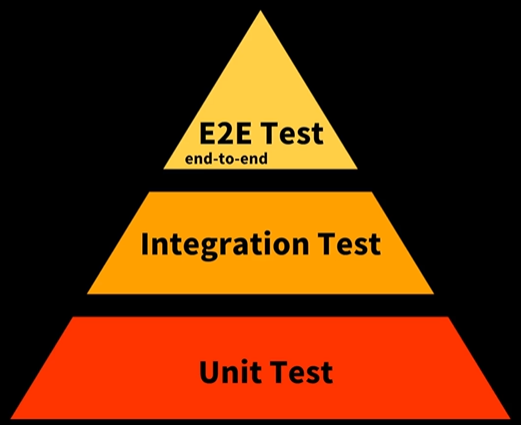
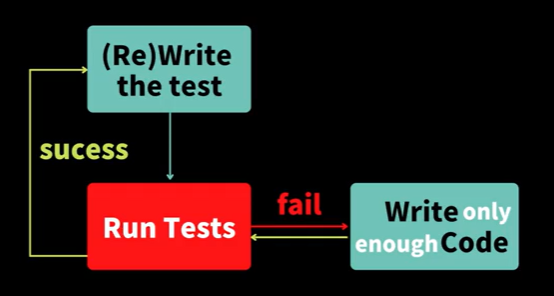

# 드림 코딩 TDD

# What is “Testing”?

> 제품과 서비스의 **품질**을 확인하고, 소프트웨어의 **버그**를 찾는 과정
> 소프트웨어 제품이 **예상하는 대로 동작 하는지 확인**하는 과정

# When “Software Test”?

기존의 테스트는 개발자가 개발 완료 후에, QA팀에서 사람이 수동적으로 테스트를 거침

- 수동적으로 인적 자원과 비용이 들어가니, 자원 많이 소요되는 단점
- 개발 후에도 QA팀의 테스트 완료까지 서비스까지 많은 시간이 소요되는 병목 현상 발생

따라서, 개발자가 직접 테스트 코드를 작성하여 **테스트를 자동화**하는 것이 목표!

하지만 테스트 코드를 작성한다고 해서 QA팀이 필요 없어지는 것은 아니다.

⇒ 사용자의 입장에서 다양한 유저 케이스를 테스트해야 되기 때문!

# Why “Software Test”?

1. 코드에 대한 자신감 ⇒ 테스트를 통해 내 코드의 정확성 증명 가능
2. 요구 사항을 세심한 만족
3. 이슈에 대한 예측 가능
4. 개발 단계에서 빠른 버그 트래킹 가능
5. 효율적인 리팩토링과 품질 향상
6. 코드 간 의존성을 낮춤
7. 테스트 코드를 통한 모듈의 문서화에 따른 시간 절약

# Test Pyramid



> 피라미드 상단으로 갈수록, **운영 비용 증가,** **개발 효율 감소**

> 상황과 우리가 테스트하고자 하는 목적성에 따라 다양한 테스트 기법이 존재한다. ex) Contract, A/B, Stress 등 위의 피라미드 테스트만이 존재하는 것이 아니다.

### 1. Unit Test

- 바퀴
- 함수, 모듈, 클래스

### 2. Integration Test

- 바퀴가 연결된 엔진
- 모듈들, 클래스들
- 단위 테스트들을 묶어서 서로 간의 유기성이 있는 테스트들 통합해서 테스트

### 3. E2E Test(UI 테스트, 사용자 테스트)

- 엔진이 연결된 자동차
- 하나의 플로우에 사용되는 모든 기능들을 통합적으로 테스트

# 테스트 주도 개발 (Test-Driven Development)



1. 테스트 코드를 먼저 작성
2. 테스트를 돌리면 당연히 `fail`
3. 작성한 테스트까지 `success` 개발 코드를 진행하고, 위 단계를 반복하며 코드 리팩토링

### TDD의 장점

- 사용자 입장에서 코드를 작성
- 모든 요구 사항(목표)에 대해 점검
- 좀 더 설계적인 코드 작성 가능
- 구현보단 인터페이스에 집중한 설계를 통해 코드의 퀄리티 향상

### TDD가 필요한 상황

1. 요구 사항이 명확할 때
2. 비지니스 로직일 경우
3. 협업시, 명세서(문서) 역할을 하기 위해
4. 설계에 대한 고민이 필요할 때 ⇒ 설계 전에 요구 사항에 맞추어 반영
5. UI 작성 시에는 TDD를 사용하지 않음 ⇒ 쉽지 않음

## 테스트 라이브러리 JEST

### test()

> 한 개의 독립적인 테스트를 만들 때 사용한다. 첫 인자로 테스트 명을 입력하고, 두 번째 인자에 Arrow Function을 통해 테스트 코드를 작성한다.

### expect()

> 테스트 하고자 하는 함수를 테스트한다.

### toBe()

> expect의 뒤에서 사용되며, 앞의 함수의 예상 결과 값을 입력해주면 된다. **객체 타입은 신경 쓰지 않고** **단순 값만 비교**!

```jsx
const add = require("../add");

test("", () => {
  // 테스트 코드 작성!
  expect(add(1, 2)).toBe(3);
});
```

### describe()

> 여러 개의 test들을 묶는 함수이다. it을 사용해서 여러 개의 테스트를 정의할 수 있다.

### it()

> test()함수와 동일하게 작동한다.

### toEqual()

> **객체가 일치 한지 검증**한다. 웬만한 일치를 비교할 때 이 메소드를 쓰면 된다.

### .resolves, .rejects

> Promise 반환 형태를 검사할 때가 있는데, resolves는 성공했을 때를, rejects는 실패했을 떄 반환 타입이다.

```jsx
const fetchProduct = require("../async");

describe("비동기 테스트", () => {
  // 5초 정도 delay가 있으니 비추천
  it("async - done", (done) => {
    fetchProduct().then((item) => {
      expect(item).toEqual({ item: "Milk", price: 200 });
      done();
    });
  });

  it("async - return", () => {
    return fetchProduct().then((item) => {
      expect(item).toEqual({ item: "Milk", price: 200 });
    });
  });

  // async - await 사용할 때
  it("async - await", async () => {
    const product = await fetchProduct();
    expect(product).toEqual({ item: "Milk", price: 200 });
  });

  it("async - resolves", () => {
    return expect(fetchProduct()).resolves.toEqual({
      item: "Milk",
      price: 200,
    });
  });

  it("async - resolves", () => {
    return expect(fetchProduct("error")).rejects.toBe("network error");
  });
});
```

## What is “Mock”?

> 테스트하고자 하는 코드가 의존하는 function이나 class에 대해 모조품을 만들어 '일단' 돌아가게 하는 것이다.
>
> 한마디로, 단위 테스트를 작성할 때, 해당 코드가 의존하는 부분을 **가짜(mock)로 대체**하는 기법을 말한다.
>
> **왜 가짜로 대체할까?**
>
> 테스트 하고싶은 기능이 다른 기능들과 엮여있을 경우(의존) 정확한 테스트를 하기 힘들기 때문이다.
