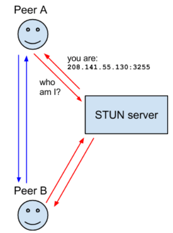
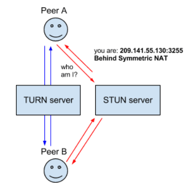
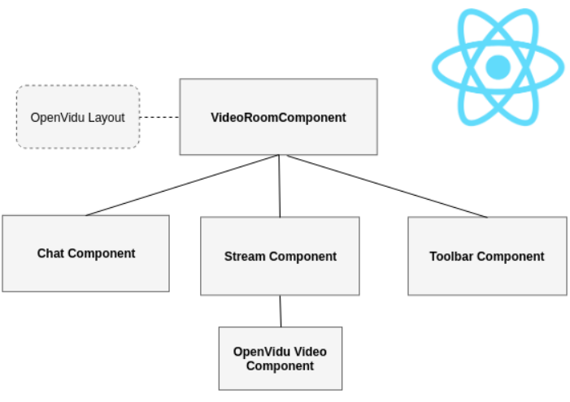

# WebRTC 정리

<aside>
💡 WebRTC(Web Real-Time Communication) 이란?
웹 브라우저 및 어플에서도 사용 가능한 비디오, 음성 및 일반 데이터가 Peer간에 실시간으로 전송되도록 지원하는 오픈 소스.
공개 웹 표준으로 구현되며 JS API로 제공한다.
</aside>

 

# 1. WebRTC의 기술 및 프로토콜

## ICE( Interative Connectivity Establishment )

- 브라우저가 peer를 통한 연결이 가능하도록 해주는 프레임워크
- peer간 단순 연결이 안되는 이유?
  - 방화벽 문제
  - 단말에 Public IP가 필요
  - Router가 peer간 연결을 허용하지 않는 경우
- 위의 작업을 해결하기 위해 ICE는 STUN과 TURN를 필요로 한다.

## STUN( Session Traversal Utilities for NAT ) 서버

- 클라이언트 자신의 Public Address를 알려준다.
- 현재 다른 peer가 접근 가능한지 여부 결정
- 클라이언트의 Public Address가 라우터의 NAT에 접근 가능한지 답변을 STUN 서버에 요청한다.

## NAT( Network Address Transilation )

- 단말에 Public IP 주소를 할당하기위해 사용

## **TURN(Traversal Using Relays around NAT) 서버**

- **TURN 서버와 연결하고 모든 정보를 그 서버에 전달**하는 것으로 **Symmetric NAT 제한을 우회**하는 것을 의미한다.
- 이를 위해 **TURN 서버와 연결**을 한 후 **모든 peer들에게 저 서버에 모든 패킷을 보내고 다시 나(TURN서버)에게 전달**해달라고 해야 한다.
- 명백히 **오버헤드가 발생**하므로 이 방법은 다른 **대안이 없을 경우만 사용**해야 한다.

[OpenVidu Docs](https://docs.openvidu.io/en/2.25.0/)

# Openvidu-call-react

- **VideoRoomComponent** : 최상단 전체 레이아웃을 담당
- **Openvidu Layout** : 위 컴포넌트의 레이아웃 담당
- **Chat Component** : 채팅 컴포넌트로써 상단 툴바의 메세지 누를시 렌더링
- **Stream Component** : 영상이 송출되는 컴포넌트, Publisher와 Subscriber로 나누어 Session에 입장한다.
  - **Publisher** : 자칫 코드를 보면 세션을 생성하는 방장? 느낌일 수 있는데, 사실은 세션에 접속해 있는 **‘나 자신’**이다.
  - **Subscriber** : 퍼블리셔와 반대 되는 개념으로 세션에 참여한 **나를 제외한** **모든 참가자**들이다. 처음 Openvidu를 접해본다면 굉장히 헷갈리는 개념이고, 필자도 헷갈렸기에 이 글을 보는 누군가는 헷갈리지 않았으면한다.
    - Subscribers 라는 Array를 map을 통해 뿌려주는데 해당 원소에는 나를 제외한 구성원들의 정보들이 담겨있다.
- **Toobar Component** : 비디오 위의 툴바 이다. 카메라, 마이크, 카메라 전환, 세션 전원 컨트롤러 버튼들이 위치해있다. CSS를 잘 만져주면 커스텀도 쉽게 가능하다.
